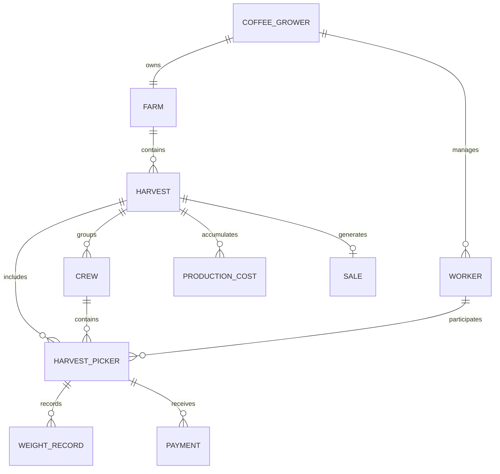

# Product Requirements Document - CosechApp

## 1. General product information

- **Name:** CosechApp.

- **Description:** Android mobile application with a single role (coffee grower), designed to replace the paper notebook used to record coffee harvesting. It allows users to open harvest cycles, manage a worker catalog, record coffee weights by picker, calculate and pay what they are owed (including the meal deduction), record coffee sales and production costs, and view the actual profit for each harvest. It includes access to the official coffee price published by the National Federation of Coffee Growers (FNC) and a news/agronomic tips section.
- **Purpose:** Replace the manual, paper-based calculation of kilograms collected and picker payments, reducing errors and giving the coffee grower clear visibility into the actual profitability of the harvest.
- **Context:** Colombia, coffee-growing areas, initially focused on a pilot farm in Narino. Designed to work under limited-connectivity conditions typical of rural coffee-growing areas.
- **Problem solved:** The manual notebook-based recording of kilograms collected by each worker and calculation of what they should be paid, which is currently slow, error-prone, and does not provide clear visibility into the harvest's actual profit.

## 2. Research and context

### Current situation
In Colombia, coffee harvesting is manual and selective: workers pass over the same plant several times because the fruit does not ripen at the same time. Most coffee farms (about 70%) are small, under 10 hectares, and usually have two harvests per year (one main harvest and one "mitaca" or "traviesa"), although in practice there may be several picking rounds or "pasones" within the same year.

### Identified problems (supported by sources)
- **Labor shortage during harvest:** the sector has reported needing hundreds of thousands of pickers during harvest peaks, with recurring regional shortages each year.
- **Informal and manual payment:** according to figures from the National Federation of Coffee Growers itself, half of pickers work on a piece-rate basis (per kilogram). Recording kilograms and calculating payment is still mostly done by hand in paper notebooks.
- **Low labor formalization:** a significant portion of harvesting work relationships are temporary, without a written contract or social security enrollment.
- **Intermediation and low value capture:** producers receive, on average, less than 10% of the final value of a cup of coffee sold in the consumer country.
- **Transportation:** on farms without their own vehicle, transporting coffee can take several hours on roads in poor condition; in 2026, official safety recommendations related to extortion in some coffee-growing areas have also been added.
- **Connectivity gap:** Narino has one of the largest urban-rural connectivity gaps in the country (more than 40 percentage points), with reports of areas where internet service is slow, unreliable, or represents a significant portion of monthly household income.

### User needs expressed (secondary press sources, not primary research)
- Simplify recording collected kilograms and calculating payment, which is currently done on paper.
- Find and organize pickers more reliably during the harvest peak.
- Stable and affordable connectivity in coffee-growing rural areas.

### Evidence and sources
National Federation of Coffee Growers (FNC), Cenicafe, Colombian business press (La Republica, Portafolio, El Tiempo, El Colombiano), academic studies (National University thesis on manual harvest scheduling, Cenicafe study on the size of harvesting crews), and analysis of existing apps in mobile app stores.

### Identified opportunities
- Colombian applications already exist that solve parts of this problem (see details in the existing apps section of the conversational research), but none combines: unlimited weight records per day, meal handling as a deduction, freely named harvest cycles, a two-level profit model (gross and actual), and a regional offline-first approach.
- The RECO component of the FNC Coffee App addresses **finding** pickers (matching), which is different from the problem this app solves: **paying them and accounting for the harvest** once they are already working.

## 3. Product objectives

- Replace the paper notebook with a reliable digital record of collected kilograms and payments.
- Automatically calculate how much each picker should be paid, including the meal deduction when applicable.
- Provide clear visibility into the actual profit of each harvest (sale minus picker payments minus production costs).
- Work reliably without an internet connection, synchronizing when one is available.
- Validate the model with a pilot farm in Narino, using an architecture that can scale to more coffee growers in the future.

## 4. Target users

### Persona: the coffee grower
- **Characteristics:** manages a coffee farm (one per account), uses an Android phone, and in some cases shares use of the app with a family member (for example, a child) from another device.
- **Usage context:** primarily in the coffee field while weighing collected coffee; also on the farm when closing out the day or harvest.
- **Needs:** simplify recording and paying pickers, understand actual profit, and stay informed about coffee prices.
- **Current problems:** wasted time and errors with the paper notebook; difficulty calculating payments when the price per kilogram changes from one harvest to another and deductions are involved (meals).
- **Digital literacy level:** variable, and in some cases low; therefore, registration/login must be very simple, without email or phone verification.

## 5. Roles and permissions

There is a single role: **Coffee grower**. This role has full access to all functions: harvest management, worker catalog, weights, payments, production costs, sales and profit, FNC price and information, and notifications. There is no picker, administrator, or cooperative role in this version; the picker has no access of any kind to the app.

## 6. User Stories

1. **As a** coffee grower, **I want to** open a new harvest cycle with a name of my choice (e.g., "first picking round"), **so that** I can organize the record for each coffee picking round separately.
   *Acceptance criterion:* only one harvest can be active at a time; the coffee grower can close it manually whenever they decide.
2. **As a** coffee grower, **I want to** register workers with a first name, last name, and optional alias, **so that** I can distinguish workers with the same name.
3. **As a** coffee grower, **I want to** add as many weights as needed per picker in a day (not just two fixed entries), **so that** the records reflect how coffee is actually weighed on my farm.
4. **As a** coffee grower, **I want to** see each picker's accumulated kilograms by week and for the full cycle, **so that** I know how much I owe without calculating it by hand.
5. **As a** coffee grower, **I want to** define the price per kilogram for each harvest, **so that** I can calculate payment correctly according to the current market.
6. **As a** coffee grower, **I want to** indicate whether a picker receives meals (per meal or for the full day), **so that** the amount is automatically deducted from the payment.
7. **As a** coffee grower, **I want to** pay a picker at any time using a "pay now" button, **so that** I am not dependent on a fixed payment cycle.
   *Acceptance criterion:* payment is calculated based on the work completed up to that point using the active harvest's price, and is recorded as a negative amount.
8. **As a** coffee grower, **I want to** see a projection of dry kilograms based on collected kilograms (cherry_kilograms / 5), **so that** I can plan my sale, knowing that it is only an estimate.
9. **As a** coffee grower, **I want to** record the actual sale of my harvest (actual dry kilograms sold and price), **so that** I can know my gross profit.
10. **As a** coffee grower, **I want to** record the harvest's production costs (supplies, fertilizers, etc.), **so that** I can know my actual profit after all expenses.
11. **As a** coffee grower, **I want to** see the coffee price published by the FNC, **so that** I can decide when to sell.
12. **As a** coffee grower, **I want to** receive a notification when the coffee price changes, **so that** I do not have to check it manually.
13. **As a** coffee grower, **I want to** read news and agronomic tips from the FNC and Cenicafe, **so that** I can improve how I manage my crop.
14. **As a** coffee grower, **I want to** sign in with my national ID number and password from any Android phone, **so that** I can access my data even if I change devices or share them with a family member.
15. **As a** coffee grower, **I want the** app to work offline in the coffee field and sync automatically when there is a signal, **so that** I do not depend on having internet at the time of weighing.
16. **As a** coffee grower, **I want to** view the history of previous harvests, **so that** I can compare how I did from one harvest to another.
17. **As a** coffee grower, **I want to** save contact information for my workers in a catalog, **so that** I can reach them during the next harvest.
18. **As a** coffee grower, **I want to** group my pickers into crews with a name of my choice (e.g., "from Huila," "same area"), **so that** I can find them and weigh their coffee faster on farms with many pickers.

## 7. Features

### 7.1 Harvest management
- **Description:** open, freely name, and manually close harvest cycles.
- **User:** coffee grower.
- **Main flow:** the coffee grower creates a harvest with a name -> the harvest becomes "active" -> workers, weights, payments, and costs are recorded within it -> the coffee grower closes it manually when finished, recording the sale.
- **Alternative flow:** not applicable; only one harvest can be active at a time per farm; the previous harvest must be closed before opening a new one.
- **Business rules:** a closed harvest moves to history and does not accept new records.
- **Required data:** harvest name, opening date, closing date, price per kilogram, status (active/closed).
- **Priority:** high (MVP).

### 7.2 Worker catalog
- **Description:** persistent worker records (first name, last name, alias, contact information) reusable across harvests.
- **User:** coffee grower.
- **Main flow:** the coffee grower adds a worker to the catalog once -> assigns the worker to the harvests in which they participate.
- **Business rules:** within a harvest, the worker is shown only by first name/last name or alias (without exposing all contact information).
- **Required data:** first name, last name, alias (optional), phone number or other contact information (optional).
- **Priority:** high (MVP).

### 7.3 Assigning pickers to a harvest and archiving
- **Description:** link catalog workers to the active harvest; if a picker stops working before it ends, archive the picker within that harvest.
- **User:** coffee grower.
- **Business rules:** an archived picker retains their weight and payment history within that harvest.
- **Priority:** high (MVP).

### 7.4 Weight records
- **Description:** record kilograms collected by a worker, allowing as many weights as needed in a day ("+" button).
- **User:** coffee grower (or an authorized family member using the same account).
- **Main flow:** the coffee grower selects the picker -> adds a weight with the kilograms -> can repeat as many times as needed that same day.
- **Validations:** kilograms must be a positive number.
- **Required data:** picker, harvest, kilograms, date and time of weighing.
- **Priority:** high (MVP).

### 7.5 Picker payment calculation (including meals)
- **Description:** calculate what a picker is owed based on their weights and the harvest's price per kilogram, deducting meals when applicable.
- **User:** coffee grower.
- **Business rules:** `amount_due = (Σ recorded_kilograms × harvest_price_per_kilogram) - meal_deduction`.
- **Required data:** harvest price per kilogram, meal indicator (yes/no), price per meal or total per day.
- **Priority:** high (MVP).

### 7.6 "Pay now" button
- **Description:** always available; calculates and records as a payment (negative amount) the work completed up to that point by a specific picker.
- **User:** coffee grower.
- **Business rules:** each payment is applied individually, not as a batch for all pickers.
- **Priority:** high (MVP).

### 7.7 Dry kilogram projection
- **Description:** calculate a projection of dry kilograms from the collected coffee cherry kilograms.
- **Business rules:** `projected_dry_kilograms = cherry_kilograms / 5` (fixed factor). This is only a projection; the actual value is entered at the time of sale.
- **Priority:** medium (MVP, as a planning tool).

### 7.8 Sale and gross profit record
- **Description:** record one sale per harvest (actual dry kilograms and sale price), and calculate gross profit.
- **Business rules:** `gross_profit = (actual_dry_kilograms × sale_price) - Σ picker_payments`.
- **Priority:** high (MVP).

### 7.9 Production costs and actual profit
- **Description:** the coffee grower records the harvest's production costs (purchases, supplies, etc.), and the app calculates actual profit.
- **Business rules:** `actual_profit = gross_profit - Σ production_costs`.
- **Priority:** high (MVP).

### 7.10 Coffee price (FNC)
- **Description:** view the reference price published daily by the National Federation of Coffee Growers.
- **Technical note:** no official public FNC API was found; obtaining the data requires scraping its public page or using manual entry as a fallback. The last known price must be cached so it can be displayed offline.
- **Priority:** high (MVP).

### 7.11 Price notifications
- **Description:** notify the coffee grower when the price published by the FNC changes.
- **Priority:** medium (MVP).

### 7.12 News and agronomic tips
- **Description:** section with content about prices, diseases and their treatment, and fertilization tips, using the FNC and Cenicafe as sources (Tip Profesor Yarumo / Avances Tecnicos).
- **Technical recommendation:** show short summaries with a link to the original source instead of reproducing the full content, due to copyright and maintenance concerns.
- **Priority:** medium (MVP).

### 7.13 Authentication and multi-device support
- **Description:** simple sign-in with national ID number and password, without email or phone verification; includes an optional profile photo. Allows signing in from different Android devices with the same account.
- **Priority:** high (MVP).

### 7.14 Offline/online synchronization
- **Description:** all records (workers, weights, payments, costs, sales) can be captured offline and are synchronized automatically when there is internet access.
- **Business rule (concurrency):** if two devices on the same account edit the same record while both are offline, synchronization keeps the change with the most recent timestamp.
- **Priority:** high (MVP).

### 7.15 Harvest history
- **Description:** view previously closed harvests, including their worker, payment, sale, and profit information.
- **Priority:** high (MVP).

### 7.16 Crews (picker grouping)
- **Description:** within the active harvest, the coffee grower can group pickers into "crews" with a free-form name they define (e.g., "from Huila," "same area"), so they can find and weigh them faster.
- **User:** coffee grower.
- **Origin:** this feature arose from a real validation session with a coffee grower on a large farm, who confirmed that grouping by crew is easier than using a flat list when weighing.
- **Main flow:** the coffee grower creates a crew with a name -> assigns pickers from the active harvest to that crew -> when weighing, first navigates by crew and then selects the picker.
- **Business rules:** a picker can belong to only one crew within the same harvest; crews are always created from scratch for each harvest (they are not reused from a previous harvest), because the pickers in them are not always the same people from one harvest to another.
- **Required data:** crew name, harvest to which it belongs, list of assigned pickers.
- **Priority:** high (MVP) - replaces the flat filter/search initially proposed as the primary navigation mechanism on large farms.

## 8. User flows

1. **Registration/sign-in:** the coffee grower creates an account with a national ID number and password (and an optional profile photo) -> signs in.
2. **Opening a harvest:** creates a harvest, names it, and defines the price per kilogram.
3. **Daily field recording:** adds workers to the harvest (or selects them from the catalog) -> records weights (one or several per worker per day) -> can pay any worker at any time using "pay now."
4. **Closing a harvest:** records the actual sale (dry kilograms and price) -> adds production costs -> the app displays gross profit and actual profit -> the harvest moves to history.
5. **Synchronization:** at any point without a connection, everything above is saved locally; when signal returns, it is synchronized with the backend automatically.
6. **Price and news lookup:** the coffee grower checks the FNC price and news/tips when connected, and receives a notification if the price changes.

## 9. Functional requirements

- RF-01: The system must allow users to create, name, activate, and close harvest cycles.
- RF-02: The system must allow users to create and edit a worker catalog with first name, last name, alias, and contact information.
- RF-03: The system must allow users to assign workers to an active harvest.
- RF-04: The system must allow multiple weights per worker per day.
- RF-05: The system must calculate a worker's payment based on their weights, the harvest's price per kilogram, and the meal deduction.
- RF-06: The system must allow users to pay a worker at any time, recording the amount as a negative value.
- RF-07: The system must calculate a projection of dry kilograms from coffee cherry kilograms (cherry_kilograms / 5).
- RF-08: The system must allow one sale per harvest and calculate gross profit.
- RF-09: The system must allow users to record production costs and calculate actual profit.
- RF-10: The system must display the coffee price published by the FNC, with the date of the most recent available data.
- RF-11: The system must notify the coffee grower when the coffee price changes.
- RF-12: The system must display agronomic news/tips from the FNC and Cenicafe.
- RF-13: The system must allow users to sign in with a national ID number and password from any Android device.
- RF-14: The system must allow complete data entry without an internet connection, synchronizing automatically when signal returns.
- RF-15: The system must display a history of closed harvests.
- RF-16: The system must allow pickers from the active harvest to be grouped into crews with a free-form name defined by the coffee grower.

## 10. Non-functional requirements

- **Performance:** recording a weight must feel instantaneous even without a connection (local-first write).
- **Security:** authentication is mandatory; communication between the app and backend must be encrypted (HTTPS).
- **Availability:** data recording must not depend on the availability of the backend or external services (FNC, Cenicafe).
- **Scalability:** the architecture (backend on Render + PostgreSQL on Neon) must be able to grow from one pilot farm to many coffee growers without redesign.
- **Usability:** interface in Spanish, with clear icons, designed for users with low digital literacy.
- **Accessibility:** text must have enough contrast to be read clearly.
- **Compatibility:** Android, via Ionic/Capacitor.
- **Privacy:** personal data of pickers (name, alias, amounts paid) is stored in the backend; access is restricted by coffee grower account.
- **Limited-connectivity / offline operation:** all operational data capture (workers, weights, payments, costs) must work offline; the FNC price and news require a connection, showing the most recently cached data when one is unavailable.

## 11. Business rules

- Each harvest has its own price per kilogram, which may vary from one harvest to another.
- A picker's payment is the sum of their weights multiplied by the active harvest's price per kilogram, minus the meal deduction when applicable.
- The "pay now" button applies individually to each picker and records the amount as a negative value, without depending on a fixed payment cycle.
- There is one sale per harvest (partial sales are not allowed).
- Gross profit = sale - picker payments. Actual profit = gross profit - production costs. This value represents the **harvest profit**, not a complete financial balance for the farm: it does not include the value of the coffee grower's own labor, tool depreciation, or land costs, which are business overhead costs and are not charged to a harvest. The interface must show it with a label that makes this clear (e.g., "Harvest profit"), to prevent it from being confused with the agricultural business's total profitability.
- The dry kilogram formula (cherry_kilograms / 5) is fixed and is only a projection; the actual value is entered at the time of sale.
- In synchronization conflicts between two devices on the same account, the change with the most recent timestamp wins.
- A worker who leaves before the harvest ends is archived, retaining their history within that harvest.

## 12. Data model

**Main entities:**

- **CoffeeGrower:** id, national_id, password (hash), profile_photo (optional).
- **Farm:** id, coffee_grower_id (one farm per coffee grower).
- **Harvest:** id, farm_id, name, price_per_kilogram, status (active/closed), opening_date, closing_date.
- **Worker (catalog):** id, coffee_grower_id, first_name, last_name, alias (optional), phone_number (optional).
- **HarvestPicker:** id, harvest_id, worker_id, harvest_alias (optional), crew_id (optional), status (active/archived).
- **Crew:** id, harvest_id, name.
- **WeightRecord:** id, harvest_picker_id, kilograms, date_time.
- **Payment:** id, harvest_picker_id, amount (negative), includes_meals (boolean), meal_detail (price per meal or total per day), date_time.
- **ProductionCost:** id, harvest_id, description, amount (negative), date.
- **Sale:** id, harvest_id, actual_dry_kilograms, sale_price, date.
- **FNCPrice (cache):** id, value, query_date.
- **Notification:** id, coffee_grower_id, type (price change), date, read (boolean).

## 13. Proposed architecture

- **Frontend / mobile app:** Ionic + Capacitor + Angular, within a monorepo. The exact versions of each dependency (Angular, Ionic, Capacitor, etc.) are defined in the project's `package.json`; review that file as the source of truth.
- **Local storage (offline):** SQLite on the device via `@capacitor-community/sqlite` (with `jeep-sqlite` for browser testing).
- **Backend:** REST API deployed on Render. Specific framework: NestJS.
- **Database:** PostgreSQL hosted on Neon.
- **Synchronization:** each local record is marked as "pending synchronization"; when a connection is detected (via `@capacitor/network`), it is sent to the backend; in conflicts, the last-write rule is applied (most recent timestamp).
- **Authentication:** national ID number + password; use JWT.
- **FNC price retrieval:** periodic process in the backend (scraping the FNC public page) that updates the price available for lookup from the app.

## 14. API and communication between components

Initial endpoint proposal (to be validated with the development team):

- `POST /auth/login`, `POST /auth/register`
- `GET/POST /harvests`, `PATCH /harvests/:id/close`
- `GET/POST /workers`
- `POST /harvests/:id/pickers`
- `POST /weights`
- `POST /payments`
- `POST /production-costs`
- `POST /sales`
- `GET /fnc-price`
- `GET /news`
- `POST /sync` (batch submission of records pending synchronization)

## 15. Notifications

- **Event:** change in the coffee price published by the FNC.
- **Recipient:** coffee grower.
- **Channel:** push notification via Firebase Cloud Messaging (FCM), using the official `@capacitor/push-notifications` plugin (which already integrates the FCM SDK on Android without requiring additional libraries).

## 16. Location and GPS

No geolocation use case was defined for this version.

## 17. Offline operation

The following must work completely offline: harvest management, worker catalog, weight records, payments, production costs, and sales. The following require a connection: FNC price lookup (the last cached value is displayed if there is no internet), news/tips, push notifications, and synchronization with the backend.

## 18. Security and privacy

- **Authentication:** national ID number and password, without email or phone verification (because some users have low digital literacy).
- **Storage of third-party personal data:** picker data (name, alias, amounts paid) is stored in the backend, not only locally.
- **Transmission:** encrypted (HTTPS) between the app and backend.
- **Applicable regulation (habeas data):** Law 1581 of 2012 (habeas data) applies to any processing of personal data in Colombia, regardless of the project's size. Formal registration in the RNBD (National Database Registry, with the SIC) is only mandatory for entities with total assets above 100,000 UVT, so it very likely does not apply during this pilot/academic phase. The underlying obligations do apply from the beginning: (a) prior, express, and informed authorization from the coffee grower upon registration to process their data and the data of pickers they enter (a checkbox with a short notice is sufficient for this scope); (b) a privacy notice/data processing policy accessible from the app; (c) data minimization, already satisfied by collecting no more than the pickers' first name/last name/alias. If the project scales beyond the pilot phase, review whether the asset threshold for the RNBD is exceeded.

## 19. Administrative panel

Not applicable in this version. All management is performed from the mobile app; no separate web panel was defined.

## 20. MVP

### MVP
Includes everything defined in this document: simple multi-device authentication, harvest management (open/name/close, one active at a time), worker catalog, assignment and archiving of pickers by harvest, grouping pickers into crews, unlimited weight records per day, picker payment calculation and payment (with meal deduction), "pay now" button, dry kilogram projection, one sale per harvest, production cost records, gross profit and harvest profit calculation, FNC price lookup with change notifications (via FCM), news/tips section (FNC and Cenicafe), harvest history, and offline operation with synchronization.

### Later version
No additional features were defined for this category; the scope agreed upon during this conversation is considered complete as written, with no features deferred to a subsequent version.

### Future possibilities
No ideas were defined for this category in this round of work.

## 21. Success metrics

No quantitative product analytics metrics were defined for this version (it was explicitly confirmed that they are not a priority at this time). As a minimum qualitative validation, it is suggested that the pilot coffee grower be asked whether the app actually replaces use of the paper notebook in day-to-day work.

## 22. Risks and mitigations

- **Technical risk - dependence on scraping for the FNC price** (there is no official public API): mitigate by caching the last known price and monitoring changes to the site's structure.
- **Technical risk - multi-device synchronization conflicts:** mitigated by the last-write rule (most recent timestamp), documented in section 11.
- **Adoption risk - low digital literacy:** mitigated with simplified login (without email/phone verification) and an interface with icons.
- **Market risk - functional overlap with existing apps** (Reccon, El Recolector): differentiation comes from handling meals as a deduction, freely named harvests, a two-level profit model, and a regional offline-first approach.
- **Legal risk - reproduction of third-party content** (FNC, Cenicafe) in the news section: mitigate by showing summaries with a link to the original source, not the full content.
- **Operational risk - the picker has no way to verify their own kilograms or payments** because they do not have access to the app: consciously accepted because a single role (coffee grower) was defined.

## 23. Dependencies

- FNC public price page (`federaciondecafeteros.org`) - no documented official API.
- Cenicafe content (Tip Profesor Yarumo / Avances Tecnicos) and FNC content for the news section.
- Render (backend hosting) and Neon (PostgreSQL hosting).
- Firebase Cloud Messaging (FCM), via the `@capacitor/push-notifications` plugin, for price-change notifications.

## 24. Assumptions

- It is assumed that payments and production costs must also be recordable offline, following the same offline architecture as pickers and weights (the coffee grower explicitly prioritized pickers and kilograms, but did not exclude anything else).
- It is assumed that cloud backup (PostgreSQL) alone meets the need for data recovery after losing or changing phones, without an additional manual backup mechanism.

## 25. Roadmap

Since it was agreed not to define features for a "later version," this roadmap organizes the construction of the already-defined MVP into phases (rather than describing evolution toward new features):

1. **Phase 1 - Foundation:** authentication (national ID number/password), harvest management, worker catalog.
2. **Phase 2 - Operational recording:** assign pickers to a harvest, record unlimited weights per day.
3. **Phase 3 - Payments:** calculate payment per picker, meal deduction, "pay now" button.
4. **Phase 4 - Harvest closeout:** dry kilogram projection, sale record, production costs, gross and actual profit, harvest history.
5. **Phase 5 - Offline and synchronization:** local SQLite storage, connectivity detection, backend synchronization, conflict handling.
6. **Phase 6 - External information:** FNC price lookup, price-change notifications, news/tips section.

## 26. General acceptance criteria

- A complete harvest cycle can be completed (open, add workers, record weights, pay, close with sale and costs) without an internet connection at any data-capture step.
- Data captured offline synchronizes correctly with the backend when signal returns, without information loss.
- The amount calculated to pay a picker exactly matches the sum of their weights multiplied by the harvest's price per kilogram, minus the meal deduction when applicable.
- The coffee grower can sign in from a different device and view all previously recorded information.
- The displayed actual profit equals: sale - picker payments - production costs.
