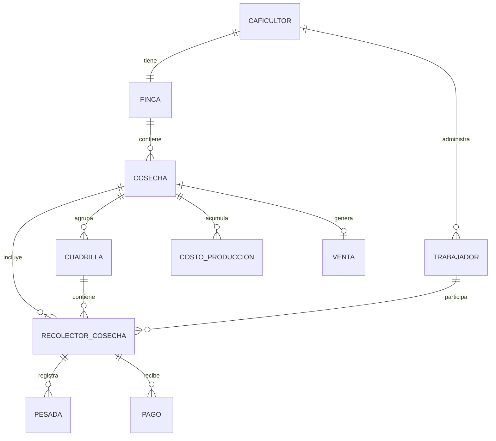

# Product Requirements Document — CosechApp

## 1. Información general del producto

- **Nombre:** CosechApp.
- **Descripción:** Aplicación móvil para Android, de un solo rol (caficultor), pensada para reemplazar el registro en cuaderno de papel de la recolección de café. Permite abrir ciclos de cosecha, administrar un catálogo de trabajadores, registrar pesadas de café por recolector, calcular y pagar lo que se les debe (incluyendo descuento de alimentación), registrar la venta del café y los costos de producción, y ver la ganancia real de cada cosecha. Incluye consulta del precio oficial del café publicado por la Federación Nacional de Cafeteros (FNC) y una sección de noticias/tips agronómicos.
- **Propósito:** Sustituir el cálculo manual y en papel de kilos recolectados y pagos a recolectores, reduciendo errores y dándole al caficultor visibilidad clara de la rentabilidad real de su cosecha.
- **Contexto:** Colombia, zonas cafeteras, con foco inicial en una finca piloto en Nariño. Pensada para funcionar en condiciones de conectividad limitada, típicas de las zonas rurales cafeteras.
- **Problema que resuelve:** El registro manual (en cuaderno) de kilos recolectados por trabajador y el cálculo de lo que se les debe pagar, que hoy es lento, propenso a errores y no da visibilidad clara de la ganancia real de la cosecha.

## 2. Investigación y contexto

### Situación actual
En Colombia la recolección de café es manual y selectiva: se pasa varias veces por la misma planta porque los frutos no maduran al mismo tiempo. La mayoría de las fincas cafeteras (cerca del 70%) son pequeñas, de menos de 10 hectáreas, y suelen tener dos cosechas al año (una principal y una "mitaca" o "traviesa"), aunque en la práctica puede haber varias cogidas o "pasones" dentro de un mismo año.

### Problemas identificados (respaldados por fuentes)
- **Escasez de mano de obra en cosecha:** el sector ha reportado necesitar cientos de miles de recolectores en los picos de cosecha, con déficits regionales recurrentes cada año.
- **Pago informal y manual:** según cifras de la propia Federación Nacional de Cafeteros, la mitad de los recolectores trabaja al destajo (por kilo). El registro de kilos y el cálculo del pago se sigue haciendo mayoritariamente a mano, en cuadernos de papel.
- **Baja formalización laboral:** buena parte de las relaciones laborales en la recolección son temporales, sin contrato escrito y sin afiliación a seguridad social.
- **Intermediación y baja captura de valor:** los productores reciben, en promedio, una fracción menor al 10% del valor final de una taza de café vendida en el país consumidor.
- **Transporte:** en fincas sin vehículo propio, el traslado del café puede tomar varias horas por vías en mal estado; en 2026 se suman recomendaciones oficiales de seguridad ante extorsión en algunas zonas cafeteras.
- **Brecha de conectividad:** Nariño tiene una de las mayores brechas de conectividad urbano-rural del país (más de 40 puntos porcentuales), con testimonios de zonas donde el internet es lento, irregular o representa una parte significativa del ingreso familiar mensual.

### Necesidades expresadas por usuarios (fuentes secundarias de prensa, no investigación primaria)
- Simplificar el registro de kilos recolectados y el cálculo de pago, hoy hecho en papel.
- Conseguir y organizar recolectores de forma más confiable en pico de cosecha.
- Conectividad estable y asequible en las veredas cafeteras.

### Evidencia y fuentes
Federación Nacional de Cafeteros (FNC), Cenicafé, prensa económica colombiana (La República, Portafolio, El Tiempo, El Colombiano), estudios académicos (tesis de la Universidad Nacional sobre programación de recolección manual, estudio de Cenicafé sobre tamaño de cuadrillas de recolección), y análisis de apps existentes en tiendas de aplicaciones móviles.

### Oportunidades identificadas
- Ya existen aplicaciones colombianas que resuelven partes de este problema (ver detalle en la sección de apps existentes de la investigación conversacional), pero ninguna combina: registro de pesadas ilimitadas por día, manejo de alimentación como descuento, ciclos de cosecha nombrados libremente, modelo de ganancia en dos niveles (bruta y real) y enfoque offline-first regional.
- El componente RECO de la App del Café de la FNC ataca el problema de **conseguir** recolectores (matching), que es distinto al problema que resuelve esta app: **pagarles y contabilizar la cosecha** una vez ya están trabajando.

## 3. Objetivos del producto

- Reemplazar el cuaderno de papel por un registro digital confiable de kilos recolectados y pagos.
- Calcular automáticamente cuánto debe pagarse a cada recolector, incluyendo el descuento de alimentación cuando aplique.
- Dar visibilidad clara de la ganancia real de cada cosecha (venta menos pagos a recolectores menos costos de producción).
- Funcionar de forma confiable sin conexión a internet, sincronizando cuando la haya.
- Validar el modelo con una finca piloto en Nariño, con una arquitectura que permita escalar a más caficultores en el futuro.

## 4. Usuarios objetivo

### Persona: el caficultor
- **Características:** administra una finca cafetera (una por cuenta), usa un celular Android, en algunos casos comparte el uso de la app con un familiar (por ejemplo, un hijo) desde otro dispositivo.
- **Contexto de uso:** principalmente en el cafetal, en el momento de pesar el café recolectado; también en la finca al cerrar el día o la cosecha.
- **Necesidades:** simplificar el registro y pago a recolectores, conocer su ganancia real, estar informado del precio del café.
- **Problemas actuales:** pérdida de tiempo y errores con el cuaderno de papel; dificultad para calcular pagos cuando el precio por kilo cambia de una cosecha a otra y hay descuentos de por medio (alimentación).
- **Nivel de alfabetización digital:** variable, en algunos casos bajo — por eso el registro/login debe ser muy simple, sin verificación de correo o teléfono.

## 5. Roles y permisos

Existe un único rol: **Caficultor**. Tiene acceso completo a todas las funciones: gestión de cosechas, catálogo de trabajadores, pesadas, pagos, costos de producción, venta y ganancia, precio e información de la FNC, y notificaciones. No hay rol de recolector, administrador ni cooperativa en esta versión — el recolector no tiene ningún tipo de acceso a la app.

## 6. User Stories

1. **Como** caficultor, **quiero** abrir un nuevo ciclo de cosecha con un nombre que yo elija (ej. "primer pasón"), **para** organizar el registro de cada cogida de café por separado.
   *Criterio de aceptación:* solo puede haber una cosecha activa a la vez; el caficultor puede cerrarla manualmente cuando decida.
2. **Como** caficultor, **quiero** registrar trabajadores con nombre, apellido y un alias opcional, **para** diferenciar a quienes tengan el mismo nombre.
3. **Como** caficultor, **quiero** agregar tantas pesadas como necesite por recolector en un día (no solo dos fijas), **para** reflejar cómo realmente se pesa en mi finca.
4. **Como** caficultor, **quiero** ver el acumulado de kilos de cada recolector por semana y por ciclo completo, **para** saber cuánto le debo sin calcular a mano.
5. **Como** caficultor, **quiero** definir el precio por kilo de cada cosecha, **para** calcular el pago correctamente según el mercado del momento.
6. **Como** caficultor, **quiero** indicar si un recolector recibe alimentación (por comida o total del día), **para** que se descuente automáticamente del pago.
7. **Como** caficultor, **quiero** pagarle a un recolector en cualquier momento con un botón "pagar ahora", **para** no depender de un ciclo fijo de pago.
   *Criterio de aceptación:* el pago se calcula sobre lo trabajado hasta ese momento con el precio de la cosecha activa, y se registra como valor negativo.
8. **Como** caficultor, **quiero** una proyección de kilos secos a partir de los kilos recolectados (kilos_cereza / 5), **para** planear mi venta, sabiendo que es solo un estimado.
9. **Como** caficultor, **quiero** registrar la venta real de mi cosecha (kilos secos reales vendidos y precio), **para** conocer mi ganancia bruta.
10. **Como** caficultor, **quiero** registrar los costos de producción de la cosecha (insumos, fertilizantes, etc.), **para** conocer mi ganancia real después de todos los gastos.
11. **Como** caficultor, **quiero** ver el precio del café publicado por la FNC, **para** decidir cuándo vender.
12. **Como** caficultor, **quiero** recibir una notificación cuando cambie el precio del café, **para** no tener que revisarlo manualmente.
13. **Como** caficultor, **quiero** consultar noticias y tips agronómicos de la FNC y Cenicafé, **para** mejorar el manejo de mi cultivo.
14. **Como** caficultor, **quiero** iniciar sesión con mi cédula y contraseña desde cualquier celular Android, **para** acceder a mis datos aunque cambie de dispositivo o los comparta con un familiar.
15. **Como** caficultor, **quiero** que la app funcione sin conexión en el cafetal y sincronice sola cuando haya señal, **para** no depender de tener internet en el momento de pesar.
16. **Como** caficultor, **quiero** consultar el historial de cosechas anteriores, **para** comparar cómo me fue de una cosecha a otra.
17. **Como** caficultor, **quiero** guardar información de contacto de mis trabajadores en un catálogo, **para** poder ubicarlos en la siguiente cosecha.
18. **Como** caficultor, **quiero** agrupar a mis recolectores en cuadrillas con el nombre que yo elija (ej. "huilenses", "mismo sector"), **para** encontrarlos y pesarles más rápido en fincas con muchos recolectores.

## 7. Funcionalidades

### 7.1 Gestión de cosechas
- **Descripción:** abrir, nombrar libremente y cerrar manualmente ciclos de cosecha.
- **Usuario:** caficultor.
- **Flujo principal:** el caficultor crea una cosecha con un nombre → la cosecha queda "activa" → se van registrando trabajadores, pesadas, pagos y costos dentro de ella → el caficultor la cierra manualmente cuando termina, registrando la venta.
- **Flujo alternativo:** no aplica — solo puede haber una cosecha activa a la vez por finca; para abrir una nueva, la anterior debe cerrarse primero.
- **Reglas de negocio:** una cosecha cerrada pasa al historial y no admite más registros nuevos.
- **Datos necesarios:** nombre de la cosecha, fecha de apertura, fecha de cierre, precio por kilo, estado (activa/cerrada).
- **Prioridad:** alta (MVP).

### 7.2 Catálogo de trabajadores
- **Descripción:** registro persistente de trabajadores (nombre, apellido, alias, datos de contacto) reutilizable entre cosechas.
- **Usuario:** caficultor.
- **Flujo principal:** el caficultor agrega un trabajador una vez al catálogo → lo asigna a las cosechas en las que participe.
- **Reglas de negocio:** dentro de una cosecha, el trabajador se muestra solo por nombre/apellido o alias (sin exponer todo su contacto).
- **Datos necesarios:** nombre, apellido, alias (opcional), teléfono u otro dato de contacto (opcional).
- **Prioridad:** alta (MVP).

### 7.3 Asignación de recolectores a una cosecha y archivo
- **Descripción:** vincular trabajadores del catálogo a la cosecha activa; si un recolector deja de trabajar antes de que termine, se archiva dentro de esa cosecha.
- **Usuario:** caficultor.
- **Reglas de negocio:** un recolector archivado conserva su historial de pesadas y pagos dentro de esa cosecha.
- **Prioridad:** alta (MVP).

### 7.4 Registro de pesadas
- **Descripción:** registrar los kilos recolectados por un trabajador, permitiendo tantas pesadas como sea necesario en un día (botón "+").
- **Usuario:** caficultor (o un familiar autorizado usando la misma cuenta).
- **Flujo principal:** el caficultor selecciona al recolector → agrega una pesada con los kilos → puede repetir cuantas veces necesite ese mismo día.
- **Validaciones:** los kilos deben ser un número positivo.
- **Datos necesarios:** recolector, cosecha, kilos, fecha y hora de la pesada.
- **Prioridad:** alta (MVP).

### 7.5 Cálculo y pago a recolectores (incluye alimentación)
- **Descripción:** calcular lo que se le debe a un recolector según sus pesadas y el precio por kilo de la cosecha, descontando alimentación si aplica.
- **Usuario:** caficultor.
- **Reglas de negocio:** `monto_a_pagar = (Σ kilos pesados × precio_kilo_cosecha) − descuento_alimentación`.
- **Datos necesarios:** precio por kilo de la cosecha, indicador de alimentación (sí/no), precio por comida o total por día.
- **Prioridad:** alta (MVP).

### 7.6 Botón "pagar ahora"
- **Descripción:** disponible siempre; calcula y registra como pago (valor negativo) lo trabajado hasta ese momento por un recolector específico.
- **Usuario:** caficultor.
- **Reglas de negocio:** cada pago se aplica de forma individual, no en bloque para todos los recolectores.
- **Prioridad:** alta (MVP).

### 7.7 Proyección de kilos secos
- **Descripción:** calcula una proyección de kilos secos a partir de los kilos en cereza recolectados.
- **Reglas de negocio:** `kilos_secos_proyectados = kilos_cereza / 5` (factor fijo). Es solo una proyección; el valor real se ingresa al momento de la venta.
- **Prioridad:** media (MVP, como herramienta de planeación).

### 7.8 Registro de venta y ganancia bruta
- **Descripción:** registrar una única venta por cosecha (kilos secos reales y precio de venta), y calcular la ganancia bruta.
- **Reglas de negocio:** `ganancia_bruta = (kilos_secos_reales × precio_venta) − Σ pagos a recolectores`.
- **Prioridad:** alta (MVP).

### 7.9 Costos de producción y ganancia real
- **Descripción:** el caficultor registra los costos de producción de la cosecha (compras, insumos, etc.), y la app calcula la ganancia real.
- **Reglas de negocio:** `ganancia_real = ganancia_bruta − Σ costos de producción`.
- **Prioridad:** alta (MVP).

### 7.10 Precio del café (FNC)
- **Descripción:** consultar el precio de referencia publicado diariamente por la Federación Nacional de Cafeteros.
- **Nota técnica:** no se encontró una API pública oficial de la FNC; la obtención del dato requiere scraping de su página pública o entrada manual como respaldo. Se debe cachear el último precio conocido para mostrarlo sin conexión.
- **Prioridad:** alta (MVP).

### 7.11 Notificaciones de precio
- **Descripción:** notificar al caficultor cuando cambie el precio publicado por la FNC.
- **Prioridad:** media (MVP).

### 7.12 Noticias y tips agronómicos
- **Descripción:** sección con contenido sobre precios, enfermedades y su tratamiento, y tips de abonado, tomando como fuentes la FNC y Cenicafé (Tip Profesor Yarumo / Avances Técnicos).
- **Recomendación técnica:** mostrar resúmenes cortos con enlace a la fuente original, en lugar de reproducir el contenido completo, por temas de derechos de autor y mantenimiento.
- **Prioridad:** media (MVP).

### 7.13 Autenticación y multi-dispositivo
- **Descripción:** inicio de sesión simple con cédula y contraseña, sin verificación de correo o teléfono; incluye foto de perfil opcional. Permite iniciar sesión desde distintos dispositivos Android con la misma cuenta.
- **Prioridad:** alta (MVP).

### 7.14 Sincronización offline/online
- **Descripción:** todo el registro (trabajadores, pesadas, pagos, costos, ventas) se puede capturar sin conexión y se sincroniza automáticamente cuando hay internet.
- **Regla de negocio (concurrencia):** si dos dispositivos de la misma cuenta editan el mismo registro estando ambos sin conexión, al sincronizar se conserva el cambio con la marca de tiempo más reciente.
- **Prioridad:** alta (MVP).

### 7.15 Historial de cosechas
- **Descripción:** consultar cosechas cerradas anteriores, con su información de trabajadores, pagos, venta y ganancia.
- **Prioridad:** alta (MVP).

### 7.16 Cuadrillas (agrupación de recolectores)
- **Descripción:** dentro de la cosecha activa, el caficultor puede agrupar a sus recolectores en "cuadrillas" con un nombre libre que él mismo defina (ej. "huilenses", "mismo sector"), para encontrarlos y pesarles más rápido.
- **Usuario:** caficultor.
- **Origen:** esta funcionalidad surgió de una validación real con un caficultor de finca grande, quien confirmó que agrupar por cuadrilla es más fácil que una lista plana al momento de pesar.
- **Flujo principal:** el caficultor crea una cuadrilla con un nombre → asigna recolectores de la cosecha activa a esa cuadrilla → al pesar, navega primero por cuadrilla y luego selecciona al recolector.
- **Reglas de negocio:** un recolector puede pertenecer a una sola cuadrilla dentro de una misma cosecha; las cuadrillas se crean siempre desde cero en cada cosecha (no se reutilizan de una cosecha anterior), porque los recolectores que las conforman no siempre son las mismas personas de una cosecha a otra.
- **Datos necesarios:** nombre de la cuadrilla, cosecha a la que pertenece, lista de recolectores asignados.
- **Prioridad:** alta (MVP) — reemplaza el filtro/buscador plano propuesto inicialmente como mecanismo principal de navegación en fincas grandes.

## 8. Flujos de usuario

1. **Registro/inicio de sesión:** el caficultor crea su cuenta con cédula y contraseña (y foto de perfil opcional) → inicia sesión.
2. **Apertura de cosecha:** crea una cosecha, le pone nombre y define el precio por kilo.
3. **Registro diario en el cafetal:** agrega trabajadores a la cosecha (o los toma del catálogo) → registra pesadas (una o varias por trabajador por día) → puede pagar a cualquier trabajador en cualquier momento con "pagar ahora".
4. **Cierre de cosecha:** registra la venta real (kilos secos y precio) → agrega costos de producción → la app muestra ganancia bruta y ganancia real → la cosecha pasa al historial.
5. **Sincronización:** en cualquier punto sin conexión, todo lo anterior queda guardado localmente; al recuperar señal, se sincroniza con el backend automáticamente.
6. **Consulta de precio y noticias:** el caficultor revisa el precio de la FNC y las noticias/tips cuando tenga conexión, y recibe notificación si el precio cambia.

## 9. Requisitos funcionales

- RF-01: El sistema debe permitir crear, nombrar, activar y cerrar ciclos de cosecha.
- RF-02: El sistema debe permitir crear y editar un catálogo de trabajadores con nombre, apellido, alias y datos de contacto.
- RF-03: El sistema debe permitir asignar trabajadores a una cosecha activa.
- RF-04: El sistema debe permitir registrar múltiples pesadas por trabajador por día.
- RF-05: El sistema debe calcular el pago de un trabajador según sus pesadas, el precio por kilo de la cosecha y el descuento de alimentación.
- RF-06: El sistema debe permitir pagar a un trabajador en cualquier momento, registrando el monto como valor negativo.
- RF-07: El sistema debe calcular una proyección de kilos secos a partir de los kilos en cereza (kilos_cereza / 5).
- RF-08: El sistema debe permitir registrar una venta por cosecha y calcular la ganancia bruta.
- RF-09: El sistema debe permitir registrar costos de producción y calcular la ganancia real.
- RF-10: El sistema debe mostrar el precio del café publicado por la FNC, con la fecha del último dato disponible.
- RF-11: El sistema debe notificar al caficultor cuando cambie el precio del café.
- RF-12: El sistema debe mostrar noticias/tips agronómicos de la FNC y Cenicafé.
- RF-13: El sistema debe permitir iniciar sesión con cédula y contraseña desde cualquier dispositivo Android.
- RF-14: El sistema debe permitir el registro completo de datos sin conexión a internet, sincronizando automáticamente al recuperar señal.
- RF-15: El sistema debe mostrar un historial de cosechas cerradas.
- RF-16: El sistema debe permitir agrupar recolectores de la cosecha activa en cuadrillas con nombre libre definido por el caficultor.

## 10. Requisitos no funcionales

- **Rendimiento:** el registro de una pesada debe sentirse instantáneo aunque no haya conexión (escritura local primero).
- **Seguridad:** autenticación obligatoria; comunicación cifrada (HTTPS) entre la app y el backend.
- **Disponibilidad:** el registro de datos no debe depender de la disponibilidad del backend ni de servicios externos (FNC, Cenicafé).
- **Escalabilidad:** la arquitectura (backend en Render + PostgreSQL en Neon) debe poder crecer de una finca piloto a muchos caficultores sin rediseño.
- **Usabilidad:** interfaz en idioma español, con iconos claros, pensada para usuarios con baja alfabetización digital.
- **Accesibilidad:** textos con contraste para ser leidos claramente.
- **Compatibilidad:** Android, vía Ionic/Capacitor.
- **Privacidad:** los datos personales de los recolectores (nombre, alias, montos pagados) se almacenan en el backend; acceso restringido por cuenta de caficultor.
- **Funcionamiento con conexión limitada / offline:** toda la captura de datos operativos (trabajadores, pesadas, pagos, costos) debe funcionar sin conexión; el precio de la FNC y las noticias requieren conexión, mostrando el último dato cacheado si no la hay.

## 11. Reglas de negocio

- Cada cosecha tiene su propio precio por kilo, que puede variar de una cosecha a otra.
- El pago de un recolector es la suma de sus pesadas multiplicada por el precio del kilo de la cosecha activa, menos el descuento de alimentación si aplica.
- El botón "pagar ahora" se aplica de forma individual por recolector y registra el monto como valor negativo, sin depender de un ciclo de pago fijo.
- La venta es única por cosecha (no se permiten ventas parciales).
- Ganancia bruta = venta − pagos a recolectores. Ganancia real = ganancia bruta − costos de producción. Este valor representa la **ganancia de la cosecha**, no un balance financiero completo de la finca: no incluye el valor del trabajo propio del caficultor, depreciación de herramientas ni el costo de la tierra, que son costos de fondo del negocio y no se cargan por cosecha. Debe presentarse en la interfaz con una etiqueta que deje esto claro (ej. "Ganancia de la cosecha"), para evitar que se confunda con la rentabilidad total del negocio agrícola.
- La fórmula de kilos secos (kilos_cereza / 5) es fija y es solo una proyección; el dato real se ingresa al momento de la venta.
- En conflictos de sincronización entre dos dispositivos de la misma cuenta, gana el cambio con la marca de tiempo más reciente.
- Un trabajador que se retira antes de terminar la cosecha se archiva, conservando su historial dentro de esa cosecha.

## 12. Modelo de datos

**Entidades principales:**

- **Caficultor:** id, cédula, contraseña (hash), foto de perfil (opcional).
- **Finca:** id, caficultor_id (una finca por caficultor).
- **Cosecha:** id, finca_id, nombre, precio_por_kilo, estado (activa/cerrada), fecha_apertura, fecha_cierre.
- **Trabajador (catálogo):** id, caficultor_id, nombre, apellido, alias (opcional), teléfono (opcional).
- **RecolectorCosecha:** id, cosecha_id, trabajador_id, alias_en_cosecha (opcional), cuadrilla_id (opcional), estado (activo/archivado).
- **Cuadrilla:** id, cosecha_id, nombre.
- **Pesada:** id, recolector_cosecha_id, kilos, fecha_hora.
- **Pago:** id, recolector_cosecha_id, monto (negativo), con_alimentación (bool), detalle_alimentación (precio por comida o total del día), fecha_hora.
- **CostoProduccion:** id, cosecha_id, descripción, monto (negativo), fecha.
- **Venta:** id, cosecha_id, kilos_secos_reales, precio_venta, fecha.
- **PrecioFNC (caché):** id, valor, fecha_consulta.
- **Notificacion:** id, caficultor_id, tipo (cambio de precio), fecha, leída (bool).

## 13. Arquitectura propuesta

- **Frontend / app móvil:** Ionic + Capacitor + Angular, dentro de un monorepo. Las versiones exactas de cada dependencia (Angular, Ionic, Capacitor, etc.) están definidas en el `package.json` del proyecto — revisar ese archivo como fuente de verdad.
- **Almacenamiento local (offline):** SQLite en el dispositivo vía `@capacitor-community/sqlite` (con `jeep-sqlite` para pruebas en navegador).
- **Backend:** API REST desplegada en Render. Framework específico: NestJS.
- **Base de datos:** PostgreSQL alojada en Neon.
- **Sincronización:** cada registro local se marca como "pendiente de sincronizar"; al detectar conexión (vía `@capacitor/network`), se envía al backend; en conflictos, se aplica la regla de última escritura (timestamp más reciente).
- **Autenticación:** cédula + contraseña; usar JWT.
- **Obtención del precio FNC:** proceso periódico en el backend (scraping de la página pública de la FNC) que actualiza el precio disponible para consulta desde la app.

## 14. API y comunicación entre componentes

Propuesta inicial de endpoints (a validar con el equipo de desarrollo):

- `POST /auth/login`, `POST /auth/registro`
- `GET/POST /cosechas`, `PATCH /cosechas/:id/cerrar`
- `GET/POST /trabajadores`
- `POST /cosechas/:id/recolectores`
- `POST /pesadas`
- `POST /pagos`
- `POST /costos-produccion`
- `POST /ventas`
- `GET /precio-fnc`
- `GET /noticias`
- `POST /sync` (envío por lotes de los registros pendientes de sincronizar)

## 15. Notificaciones

- **Evento:** cambio del precio del café publicado por la FNC.
- **Destinatario:** el caficultor.
- **Medio:** notificación push vía Firebase Cloud Messaging (FCM), usando el plugin oficial `@capacitor/push-notifications` (que ya integra el SDK de FCM en Android sin necesidad de librerías adicionales).

## 16. Ubicación y GPS

No se definió ningún caso de uso de geolocalización para esta versión.

## 17. Funcionamiento offline

Deben funcionar completamente sin conexión: gestión de cosechas, catálogo de trabajadores, registro de pesadas, pagos, costos de producción y venta. Requieren conexión: consulta del precio FNC (se muestra el último valor cacheado si no hay internet), noticias/tips, notificaciones push, y la sincronización con el backend.

## 18. Seguridad y privacidad

- **Autenticación:** cédula y contraseña, sin verificación de correo o teléfono (por baja alfabetización digital de algunos usuarios).
- **Almacenamiento de datos personales de terceros:** los datos de los recolectores (nombre, alias, montos pagados) se guardan en el backend, no solo localmente.
- **Transmisión:** cifrada (HTTPS) entre la app y el backend.
- **Normativa aplicable (habeas data):** aplica la Ley 1581 de 2012 (habeas data) a cualquier tratamiento de datos personales en Colombia, independientemente del tamaño del proyecto. El registro formal en el RNBD (Registro Nacional de Bases de Datos, ante la SIC) solo es obligatorio para entidades con activos totales superiores a 100.000 UVT, por lo que en esta fase piloto/académica muy probablemente no aplica. Sí aplican desde el inicio las obligaciones de fondo: (a) autorización previa, expresa e informada del caficultor al registrarse, para tratar sus datos y los de los recolectores que ingrese (un checkbox con aviso corto es suficiente para este alcance); (b) un aviso de privacidad/política de tratamiento de datos accesible desde la app; (c) minimización de datos, ya cumplida al no recoger más que nombre/apellido/alias de los recolectores. Si el proyecto escala más allá de la fase piloto, revisar si se cruza el umbral de activos para el RNBD.

## 19. Panel administrativo

No aplica en esta versión. Toda la gestión se realiza desde la app móvil; no se definió un panel web independiente.

## 20. MVP

### MVP
Incluye todo lo definido en este documento: autenticación simple multi-dispositivo, gestión de cosechas (abrir/nombrar/cerrar, una activa a la vez), catálogo de trabajadores, asignación y archivo de recolectores por cosecha, agrupación de recolectores en cuadrillas, registro ilimitado de pesadas por día, cálculo y pago a recolectores (con descuento de alimentación), botón "pagar ahora", proyección de kilos secos, registro de venta única por cosecha, registro de costos de producción, cálculo de ganancia bruta y ganancia de la cosecha, consulta del precio FNC con notificación de cambios (vía FCM), sección de noticias/tips (FNC y Cenicafé), historial de cosechas, y funcionamiento offline con sincronización.

### Versión posterior
No se definieron funcionalidades adicionales para esta categoría — el alcance acordado durante esta conversación se considera completo tal como está, sin funciones pospuestas a una siguiente versión.

### Futuras posibilidades
No se definieron ideas para esta categoría en esta ronda de trabajo.

## 21. Métricas de éxito

No se definieron métricas cuantitativas de analítica de producto para esta versión (se confirmó explícitamente que no son prioridad por ahora). Como validación cualitativa mínima, se sugiere confirmar con el caficultor piloto si la app efectivamente reemplaza el uso del cuaderno de papel en su día a día.

## 22. Riesgos y mitigaciones

- **Riesgo técnico — dependencia de scraping para el precio FNC** (no existe API pública oficial): mitigar cacheando el último precio conocido y monitoreando cambios en la estructura del sitio.
- **Riesgo técnico — conflictos de sincronización multi-dispositivo:** mitigado con la regla de última escritura (timestamp más reciente), documentada en la sección 11.
- **Riesgo de adopción — baja alfabetización digital:** mitigado con login simplificado (sin verificación de correo/teléfono) e interfaz con iconos.
- **Riesgo de mercado — solapamiento funcional con apps existentes** (Reccon, El Recolector): la diferenciación está en el manejo de alimentación como descuento, cosechas nombradas libremente, modelo de ganancia en dos niveles y enfoque offline-first regional.
- **Riesgo legal — reproducción de contenido de terceros** (FNC, Cenicafé) en la sección de noticias: mitigar mostrando resúmenes con enlace a la fuente original, no el contenido completo.
- **Riesgo operativo — el recolector no tiene forma de verificar sus propios kilos o pagos**, al no tener acceso a la app: riesgo aceptado conscientemente, dado que se definió un único rol (caficultor).

## 23. Dependencias

- Página pública de precio de la FNC (`federaciondecafeteros.org`) — sin API oficial documentada.
- Contenido de Cenicafé (Tip Profesor Yarumo / Avances Técnicos) y de la FNC para la sección de noticias.
- Render (hosting del backend) y Neon (hosting de PostgreSQL).
- Firebase Cloud Messaging (FCM), vía el plugin `@capacitor/push-notifications`, para las notificaciones de cambio de precio.

## 24. Supuestos

- Se asume que pagos y costos de producción también deben poder registrarse sin conexión, siguiendo la misma arquitectura offline que recolectores y pesadas (el caficultor priorizó explícitamente recolectores y kilos, pero no excluyó lo demás).
- Se asume que el respaldo en la nube (PostgreSQL) cubre por sí solo la necesidad de recuperación de datos ante pérdida o cambio de celular, sin mecanismo adicional de backup manual.

## 25. Roadmap

Dado que se acordó no definir funciones para una "versión posterior", este roadmap organiza por fases la construcción del MVP ya definido (no la evolución hacia nuevas funciones):

1. **Fase 1 — Base:** autenticación (cédula/contraseña), gestión de cosechas, catálogo de trabajadores.
2. **Fase 2 — Registro operativo:** asignación de recolectores a cosecha, registro de pesadas ilimitadas por día.
3. **Fase 3 — Pagos:** cálculo de pago por recolector, descuento de alimentación, botón "pagar ahora".
4. **Fase 4 — Cierre de cosecha:** proyección de kilos secos, registro de venta, costos de producción, ganancia bruta y real, historial de cosechas.
5. **Fase 5 — Offline y sincronización:** almacenamiento local SQLite, detección de conectividad, sincronización con backend, manejo de conflictos.
6. **Fase 6 — Información externa:** consulta del precio FNC, notificaciones de cambio de precio, sección de noticias/tips.

## 26. Criterios de aceptación generales

- Se puede completar un ciclo de cosecha entero (abrir, agregar trabajadores, registrar pesadas, pagar, cerrar con venta y costos) sin necesidad de conexión a internet en ningún paso de captura de datos.
- Los datos capturados sin conexión se sincronizan correctamente al backend al recuperar señal, sin pérdida de información.
- El monto calculado para pagar a un recolector coincide exactamente con la suma de sus pesadas multiplicada por el precio por kilo de la cosecha, menos el descuento de alimentación cuando aplique.
- El caficultor puede iniciar sesión desde un dispositivo distinto y ver toda su información ya registrada.
- La ganancia real mostrada corresponde a: venta − pagos a recolectores − costos de producción.
